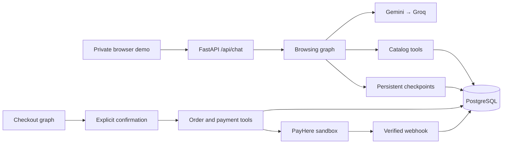

<div align="center">


# LifeStore AI Shopping Assistant

**Product discovery through conversation. Checkout with explicit confirmation.**

Python 3.12 · FastAPI · LangChain · LangGraph · PostgreSQL · PayHere Sandbox

[Quick start](#quick-start) · [Architecture](#architecture) · [Testing](#testing) · [Deployment](deploy/README.md)

</div>

LifeStore connects a conversational shopping assistant to a PostgreSQL product catalog. Customers can explore products, compare options, and check prices and availability through a private browser-based demo. Backend tools extend the workflow with cart management, confirmed checkout, and sandbox payments in Sri Lankan rupees (LKR).

## Features

- **Catalog discovery:** search by keywords, category, brand, budget, sale status, and stock; compare up to three products.
- **Multilingual conversation:** Sinhala and Tamil script detection with model-guided language responses.
- **Provider fallback:** Gemini with Groq fallback, using the same catalog tools.
- **Persistent conversations:** PostgreSQL-backed LangGraph checkpoints retain session history.
- **Cart and checkout services:** live price checks, stock validation, and a confirmation pause before order creation.
- **PayHere sandbox integration:** signed payment links, verified callbacks, and transactional stock updates.
- **Price checks and audit records:** validate Rs.-formatted reply amounts against tool results and record tool execution.

The browser demo currently supports **catalog browsing** and uses a shared test token. Cart and checkout are available as backend tools and a separate graph. Payments run in **sandbox mode**. Public customer authentication and browser checkout integration are separate deployment requirements.

## Quick start

Install Docker with Docker Compose v2 and start the Docker engine. The containers use Python 3.12 and PostgreSQL 16.

### 1. Configure

```sh
git clone https://github.com/SLTDigitalLab/lifestore-agent.git
cd lifestore-agent
cp .env.example .env
```

On Windows PowerShell, use `Copy-Item .env.example .env` for the last command.

Edit `.env` and set `GOOGLE_API_KEY`, `GROQ_API_KEY`, and a long random `CHAT_TEST_TOKEN`. Set `GEMINI_MODEL` to a model available to your account. The example database URL is for the local Compose network.

PayHere credentials are only needed to exercise sandbox payment flows. OpenAI credentials are optional and used by explicitly selected provider tests.

### 2. Initialize and start

```sh
docker compose build api
docker compose up -d --wait db
docker compose run --rm api python -m app.db.schema
docker compose run --rm api python -m scripts.seed
docker compose up -d api
```

The seed command loads the bundled demo catalog and sample transactions. Existing IDs are skipped on subsequent runs. Use the sample dataset only in a development or sandbox database.

### 3. Open the demo

Visit `http://localhost:8000/#token=YOUR_CHAT_TEST_TOKEN`, replacing the placeholder with your local token. The page stores the token in session storage and removes it from the address bar.

Try: “What categories do you have?”, “Find a Wi-Fi extender”, or “Compare these two products.”

- Chat interface: `http://localhost:8000/`
- API documentation: `http://localhost:8000/docs`
- Health check: `http://localhost:8000/health`

The health endpoint reports API availability. Stop services with `docker compose down`; database data remains in the Docker volume.

## Architecture



Browsing and checkout have separate graph entry points. Catalog queries read current database values. Cart tools reprice items from current product data; checkout revalidates the confirmed snapshot. Stock is deducted when a verified successful payment callback is processed, rather than when an item enters a cart.

| Path | Purpose |
| --- | --- |
| `app/api/` | Browser demo, chat endpoint, payment pages and webhook |
| `app/core/` | Model fallback, price validation and tool auditing |
| `app/graph/` | Browsing, checkout and checkpoint management |
| `app/tools/` | Catalog, cart and order operations |
| `app/db/` | SQLAlchemy models, sessions and schema initialization |
| `scripts/seed.py` | Repeatable sample-data loading |
| `tests/` | Unit, database, graph and provider tests |
| `deploy/` | Container deployment, Nginx and TLS configuration |

## Configuration

| Variable | Purpose |
| --- | --- |
| `GOOGLE_API_KEY`, `GROQ_API_KEY` | Required for conversational browsing |
| `GEMINI_MODEL` | Primary Gemini model selection |
| `CHAT_TEST_TOKEN` | Bearer token for the private demo |
| `DATABASE_URL` | PostgreSQL connection string |
| `PAYHERE_MERCHANT_ID`, `PAYHERE_MERCHANT_SECRET` | Sandbox merchant credentials |
| `PAYHERE_PUBLIC_BASE_URL` | Public HTTPS origin for payment callbacks |
| `PAYHERE_MODE` | Keep as `sandbox` |
| `OPENAI_API_KEY`, `OPENAI_MODEL` | Optional OpenAI provider regression tests |

Keep credentials in local environment files. Commit only the empty configuration examples.

## Testing

With the database running and the API image built, run the default suite:

```sh
docker compose run --rm -e TEST_DATABASE_URL=postgresql+psycopg://lifestore:lifestore_dev@db:5432/lifestore api python -m pytest -q -p no:cacheprovider
```

Database tests create isolated temporary schemas. The default suite skips live provider tests and does not make real payment requests.

To opt into live model smoke tests, configure provider credentials and run:

```sh
docker compose run --rm -e TEST_DATABASE_URL=postgresql+psycopg://lifestore:lifestore_dev@db:5432/lifestore api python -m pytest tests/test_llm_integration.py tests/test_browsing_integration.py --run-live-llm -q -p no:cacheprovider
```

The provider regression suite is selected with `tests/test_regression.py --provider gemini`, `--provider groq`, or `--provider openai`. Live tests call external services and may incur provider charges.

## Deployment

Use the standalone [production deployment guide](deploy/README.md) for PostgreSQL, FastAPI, Nginx, HTTPS certificates and backups. Copy `deploy/.env.example` to `.env.prod` and supply deployment-specific values.

Schema initialization uses `create_all`; see [migration notes](migrations/README.md) before changing an existing schema. PayHere sandbox testing requires a reachable HTTPS callback URL and sandbox merchant credentials.
